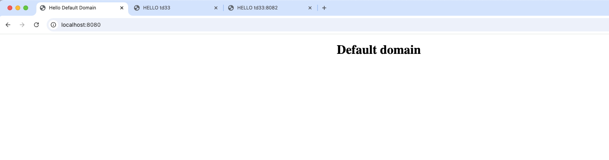
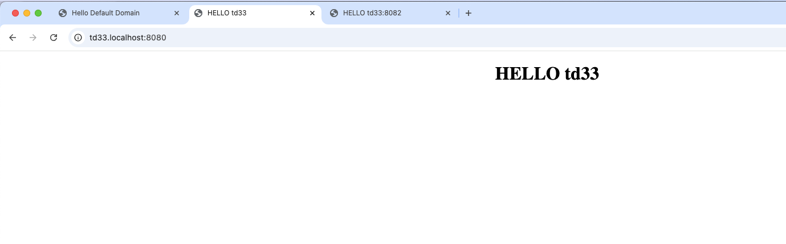
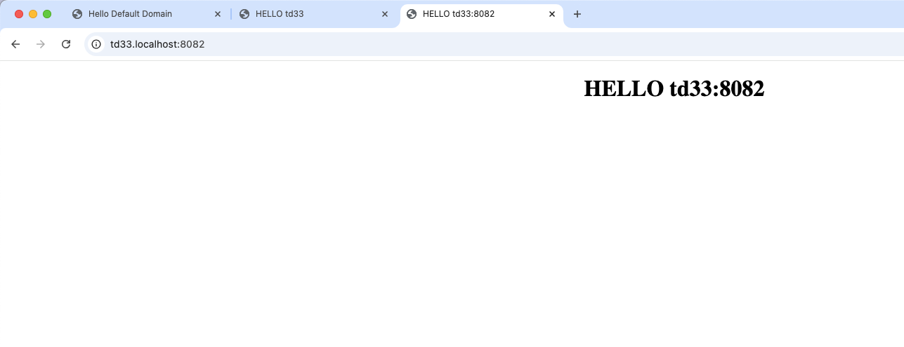
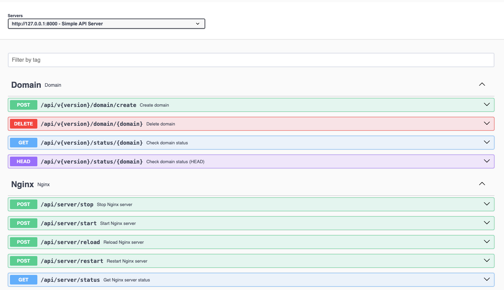

# CH Test Task

____
Тестове завдання
> Нижче будуть показані можливі варіанти деплойменту (розвертання) проєкту.

## Приклад роботи аплікації 

_Стандартний домен_ 


_Тестовий піддомен_ 


_Стандартний піддомен з портом_ 


## Requirements

- PC
- Browser
- Docker(Desktop)
- 16GB Memory

## Environments

## Основні шляхи

### `CITYHOST_DOMAINS_PATH`
Папка NGINX, у якій знаходяться конфігурації доменів користувачів.  
**Приклад:** `/etc/nginx/conf.d`

### `CITYHOST_WWW_PATH`
Папка, де розміщуються файли сайтів користувачів.  
**Приклад:** `/var/www/html`

### `CITYHOST_STUBS_PATH`
Папка зі шаблонами сторінок та конфігурацій  
(заглушки, шаблонні NGINX-конфіги тощо).  
**За замовчуванням:** `/var/www/laravel/storage/stubs`

---

## Діапазон портів

### `CITYHOST_PORT_MIN`
Мінімальний номер порту, з якого користувач може створювати нові служби.  
**Default:** `8001`, для тесту

### `CITYHOST_PORT_MAX`
Максимальний номер порту, до якого користувач може створювати нові служби.  
**Default:** `8005`, для тесту

---

## Інше

### `CITYHOST_V3_ENABLE`
Увімкнути тестову версію API `/api/v3`.  
Приймає `true` або `false`.  
**Default:** `false`

## API Endpoints

Маршрути починаються з `/api/`, наприклад, http://localhost:8000/api/v1/domain/create .

- `{domain}` - Назва домену (в нашому випадку, піддомену). Формат: a-z, 0-9 та -
- `{version}` - версія API (Підтримується версії 1 та 2).

### Керування "Доменами"

#### Приклад запиту для цього розділу `{HOST}/api/v[1|2|3]/domain/create`

| Endpoint         | Method      | Description                                                                                                                                       |
|------------------|-------------|---------------------------------------------------------------------------------------------------------------------------------------------------|
| /domain/create   | POST        | Для `v1` ви можете створити піддомен `test.localhost`, а в версії `v2` Ви можете **додатково** вказати порт `test.localhost:8080`                 |
| /domain/{domain} | DELETE      | Видалення домену відповідної версії (`v2` з портом або `v1` без порту)                                                                            |
| /status/{domain} | GET or HEAD | Тут Ви зможете отримати статус створення Вашого домену(звісно за сприятливих умов, якщо папка не буде створена на момент виклику даного маршруту) |

> Також є тестова версія - 3, яка **імітує** довгу роботу (затримка 3 сек.) аплікації та доступна на маршрутах
`*/domain/create` та `*/domain/status`.

### Керування NGINX

#### Приклад запиту для цього розділу `{HOST}/api/server/start`

| Endpoint            | Method | Description                         |
|---------------------|--------|-------------------------------------|
| /api/server/start   | POST   | Запустити NGINX                     |
| /api/server/stop    | POST   | Зупинити NGINX                      |
| /api/server/restart | POST   | Перезавантаження NGINX              |
| /api/server/status  | GET    | Отримати статус NGINX (nginx -t)    |
| /api/server/reload  | POST   | Перезавантаження конфігурації NGINX |

## SwaggerUI

Також для спрощеного тестування, є інтерфейс, який дозволяє протестувати вище зазначені маршрути.

Щоб отримати доступ, введіть в адресному рядку `{HOST}/api/documentation` або скористуйтесь `docs/api-docs.json`.



## Profiles

### Для запуску обраного профілю викорстовуйте команду

```docker compose --profile $profile_name up```

де `$profile_name` - це ім'я профілю

## Список можливих профілів та їх опис

> При реалізації даного проєкту я не зміг прийти до одного кінцевого варіанту, тому зробив декілька варіантів.

## simple

> Профіль `simple` розгортає nginx та laravel в одному контейнері.
> Алгоритм "схожий" на роботу nginx-proxy-manager

## medium

> Профіль `medium` розгортає nginx та laravel на різних контейнерах.
> <br> В контейнері з nginx встановлюється php та laravel відправляє на нього запити.
> <br> Тут `{HOST}` змінюється для розділу Керування NGINX

## hard

> Профіль `hard` розгортає контейнер laravel.
> Для кожного нового домену розгортається новий контейнер nginx на машині хоста через проксі
`tecnativa/docker-socket-proxy`.
>
> Тут `{HOST}` змінюється для розділу Керування NGINX

**P.S. При правильній конфігурації `tecnativa/docker-socket-proxy` ризик пошкодження основного середовища мінімальний.**

### P.P.S. Однак він не дорівнює нулю


## Summary

> Також можна було розгортати контейнери в контейнері (Docker-in-Docker), але це ускладнило б налаштування та
> маршрутизацію доменів (наприклад, test.localhost:8081 та test2.localhost:8081) і виходить за рамки цього тестового
> завдання.

При отриманні цього завдання, моє бачення вирішення цього завдання базувалося на основі профілю `simple`.

Найбільше часу я витратив на ознайомлення з іншими проєктами, які б вирішували або часткового "допомогли" розв'язати
архітектурне питання.

### Способи розширення/модернізації

- Додати черги RabbitMQ та/або Redis, щоб не відразу створювати конфігурації та "запланувати" подальше масштабування.
- Можливо слід подивитись в мікросервісну архітектуру та запускати кожен компонент в окремому контейнері, але тут вже
  потрібен оркестратор, що, як на мене, додає своїх складностей.
- Думаю, що обов'язково потрібно реалізувати систему Event-ів штатними можливостями Laravel, та йти до worker-ів та
  черг.
- Також потрібно модернізувати систему логування подій, тестових середовищ, резервного копіювання